# InstaPost
A website where users can signin and post their life events, memes and everyone having an account can view them. Users will also be able to like other's posts, follow and unfollow others, view their and other user's profile and also comment on other's posts. Users will also be able to chat with other users who are both their followers and followings  
# Link for the website:
https://instaa-post.netlify.app/

# UI of the Application
### SignUp
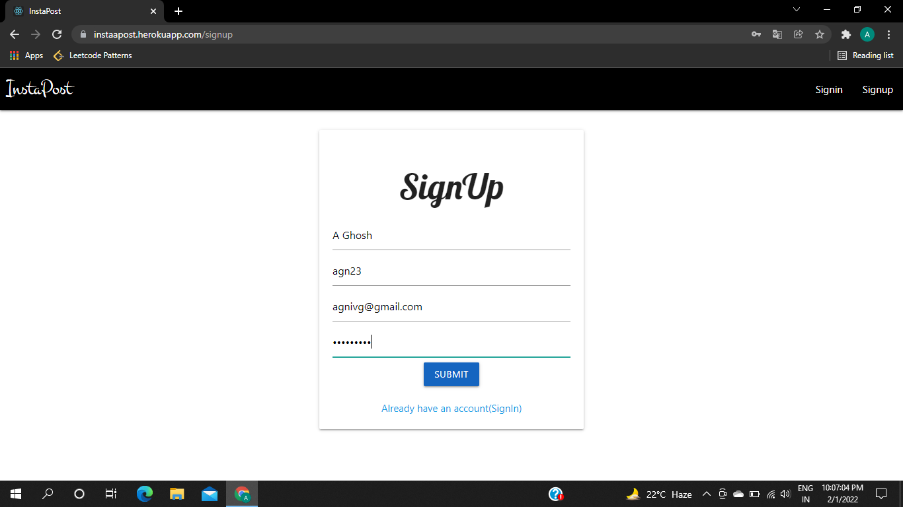</img>

### SignIn page after successful signup
</img>

### SignIn
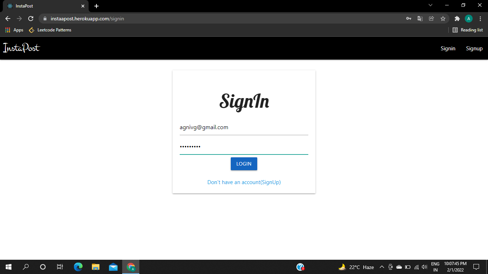</img>

### Home(Desktop view)
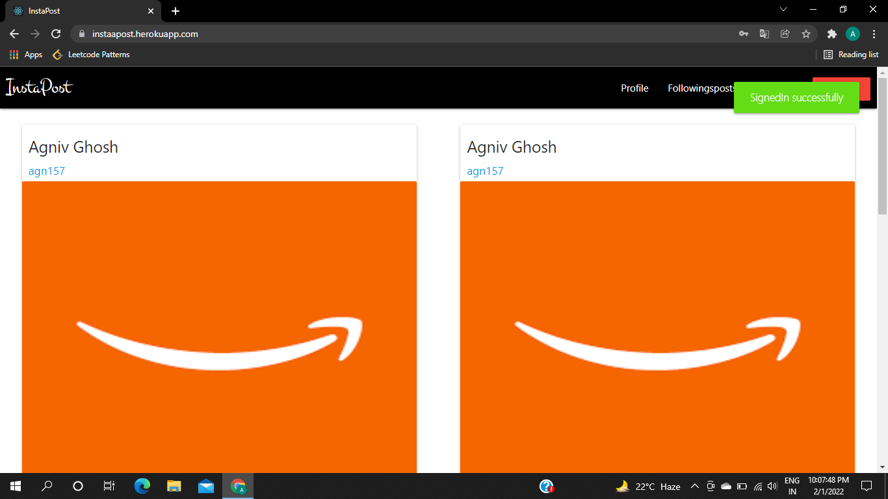</img>

### Home(Mobile view)
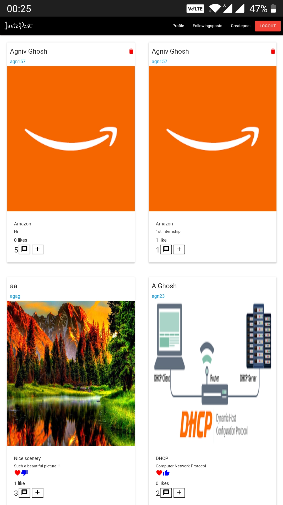</img>

### Create Post
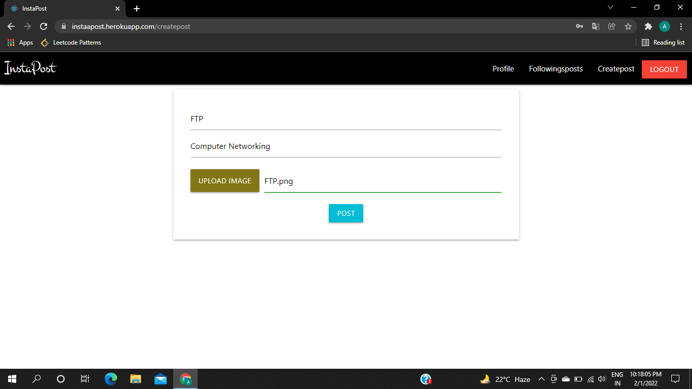</img>

### User Profile of other user
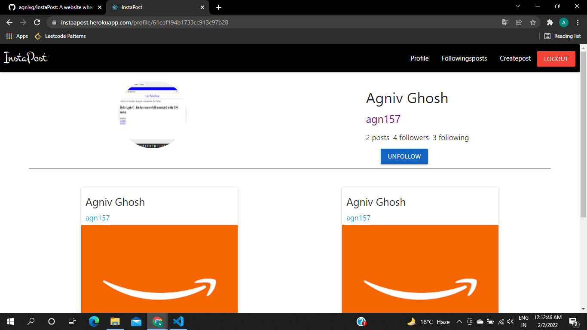</img>

### User Profile of other user before adding comment
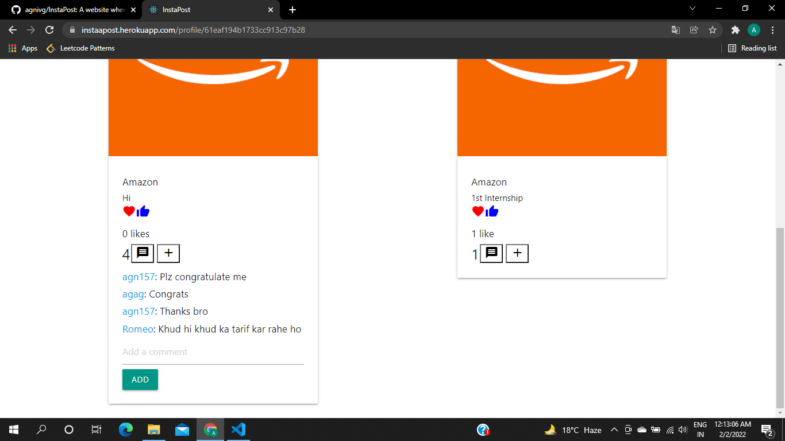</img>

### User Profile of other user after adding comment
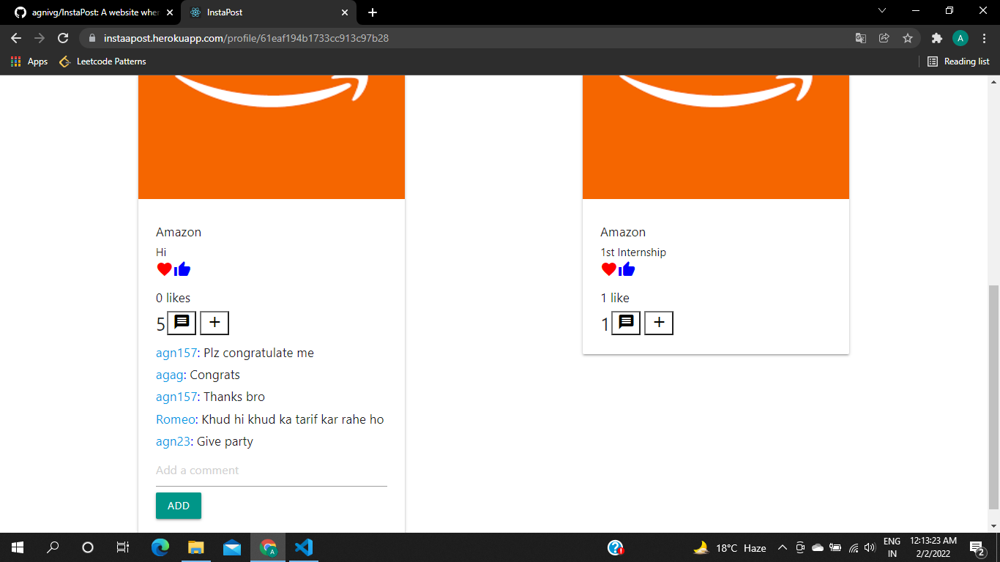</img>
 
### User Profile of current user
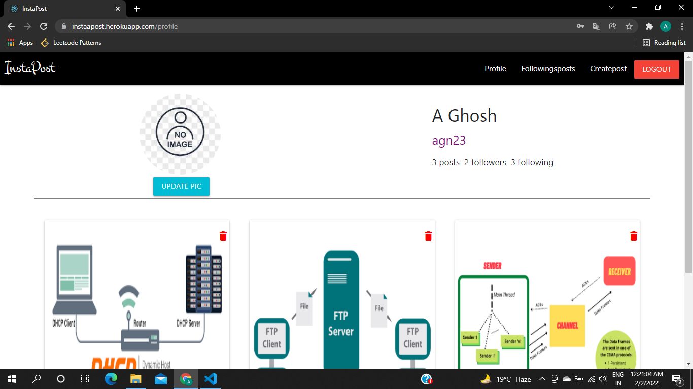</img>

### Current user's posts comments
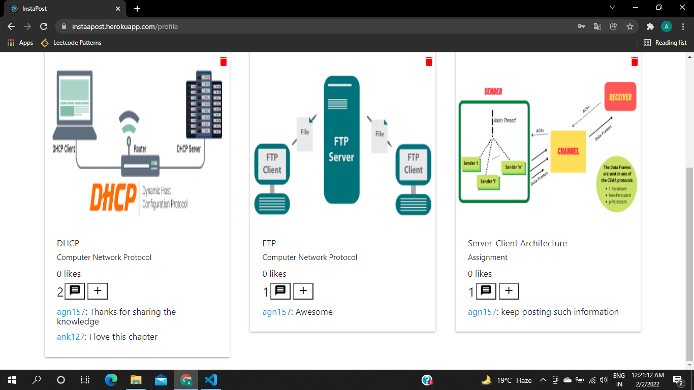</img>
                       
### Current user's profile with his/her follower's and following's names and after updating his profile pic
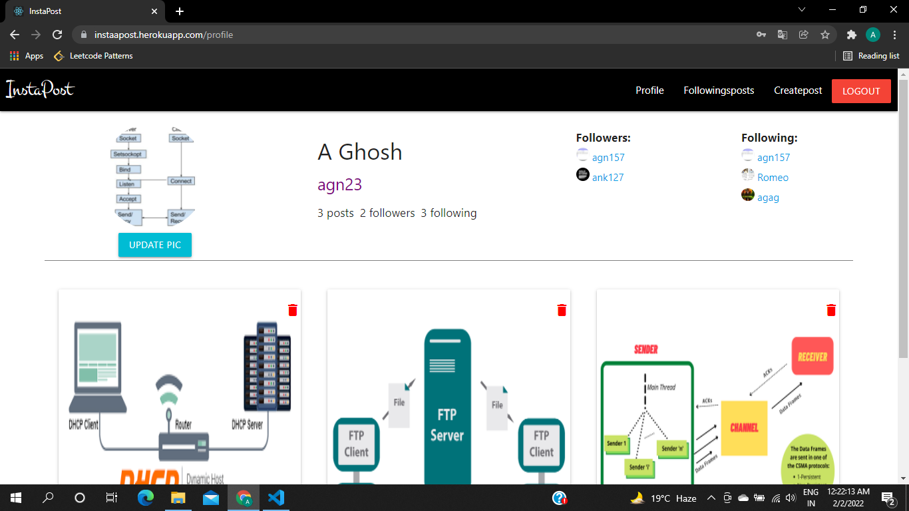</img>
                      
### Current user's following's posts
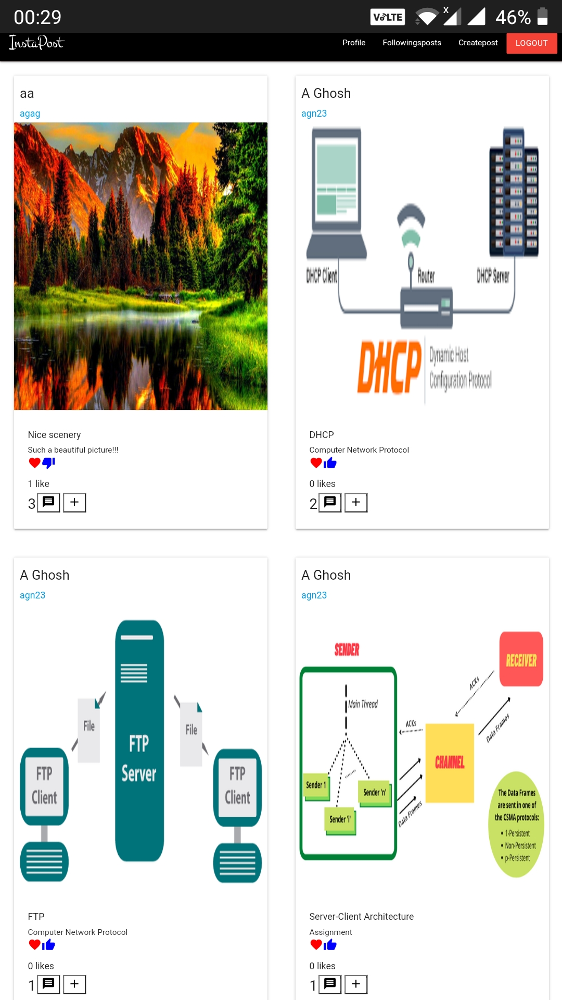</img>
                         
### Live Chat interface where user can send messages, their location and images with other users and chatting happens realtime where users get notifications from Admin when other user is online and offline
### (Desktop View)
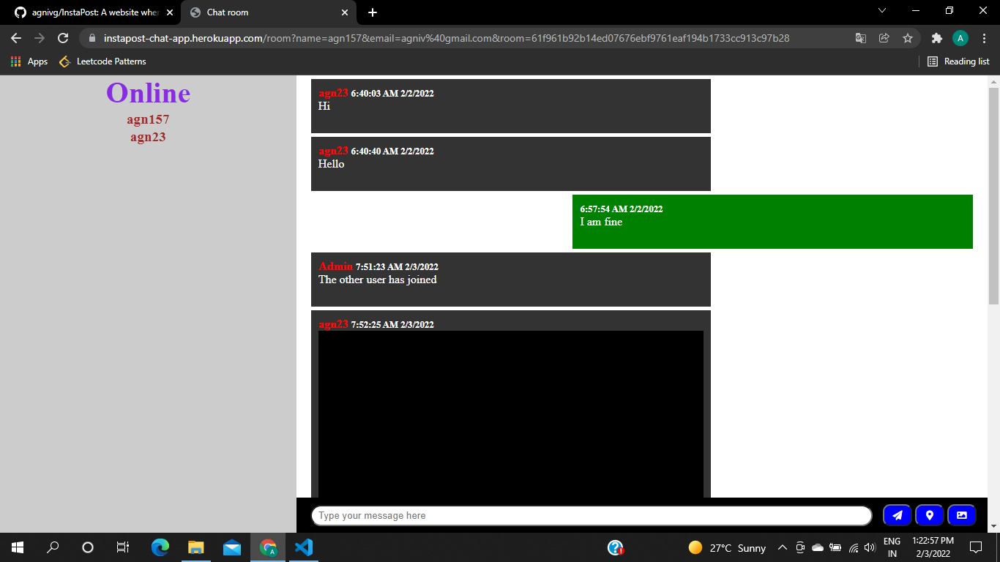</img>
### (Mobile View)  
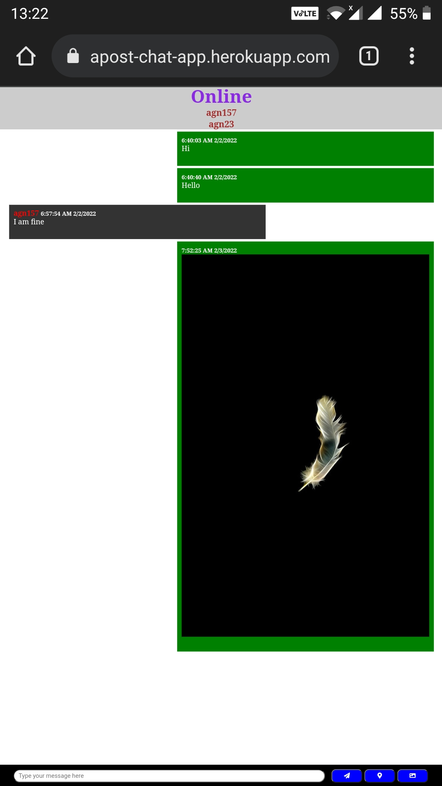</img>

### Notification of other user's status(online/offline)
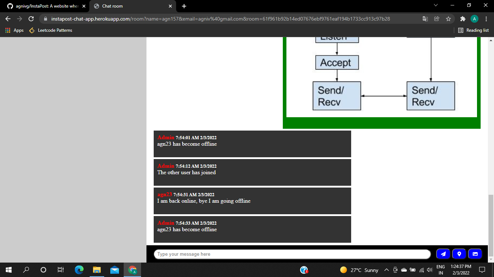</img>
